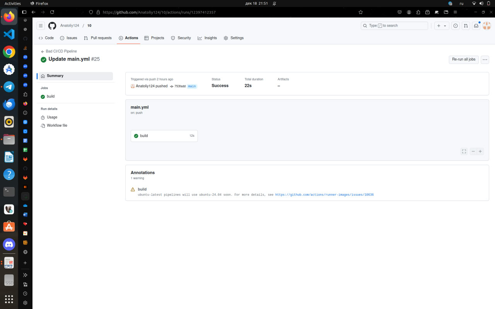
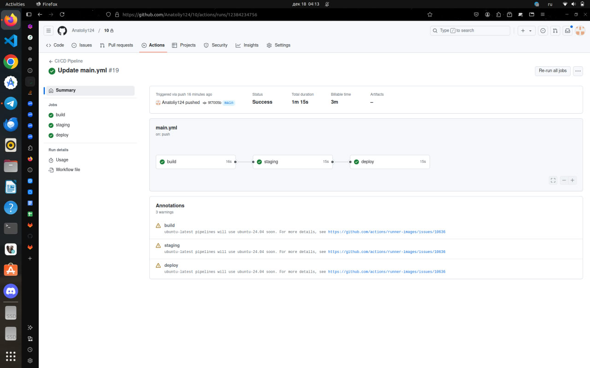

# Отчёт по лабораторной работе по DevOps №3
## Задачи:
- написать плохой CI/CD файл, содержащий не менее 5 bad practices
- исправить файл, объяснив суть этих bad practices
## Содержание:
- ["Bad" practies](#bad-practies-(плохиши-фуу))
- ["Good" practies](#good-practies-(нормальные-мужики-внатуре))

## "Bad" practies(плохиши фуу)


Что же такого **"bad"** в этом файле?

1. Плохиш: ```name: Clone repository manually
  run: git clone https://github.com/Anatoliy124/10.git```
в чем суть этого плохиша: здесь используется ручное клонирование репозитория это ужасно, так как это помешает, например, авторизации для приватных репозиториев.
   крутой: `name: Checkout code
  uses: actions/checkout@v3`
   тут используется очень интересный момент), ведь здесь `actions/checkout` автоматически клонирует код из репозитория, включая обработку подмодулей и авторизации. 
3. Плохиш: `name: Set up Node.js (Bad Practice)
  uses: actions/setup-node@v3
  with:
    node-version: '14'
`в чем суть этого плохиша: тут использование конкретной версии без возможности изменения через переменные очень усложняет обновления, это плохо


   крутой: `name: Set up Node.js
  uses: actions/setup-node@v3
  with:
    node-version: ${{ env.NODE_VERSION }}
`
   ура, тут есть переменная окружения (NODE_VERSION) это упрощает поддержку.
3.Плохиш: `name: Install dependencies without caching
  run: npm install
`в чем суть этого плохиша: каждый раз зависимости скачиваются занов, это долго.

   крутой: `name: Cache Node.js modules
  uses: actions/cache@v3
  with:
    path: ~/.npm
    key: ${{ runner.os }}-node-${{ hashFiles('**/package-lock.json') }}
    restore-keys: |
      ${{ runner.os }}-node-
`
   супер, тут есть кэширование, поэтому все быстро.
4. Плохиш: `on: push
`в чем суть этого плохиша: пайплайн запускается каждый раз.

   крутой: `on:
  push:
    branches:
      - main
  pull_request:
    branches:
      - main
`
   Крутяк, этот скрипт уменьшает нагрузку на CI/CD, так как уберает ненужные запуски.
5. Плохиш: `name: Echo success message
  run: echo "Build complete!"
`в чем суть этого плохиша: непонятное название шагов.

   крутой: `name: Run tests
name: Deploy application
`
   вау, мы используем понятный нэименг, теперь все понятно.
## "Good" practies(нормальные мужики внатуре)



